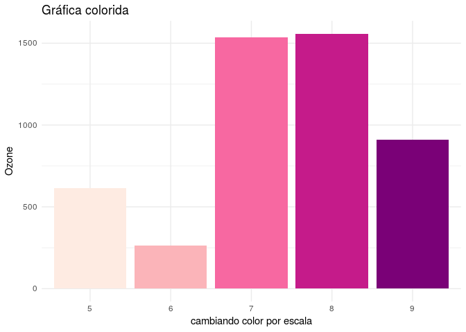
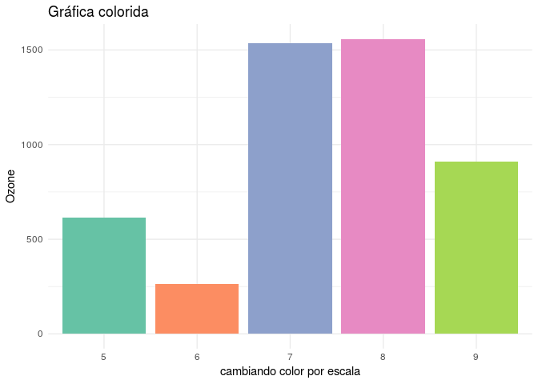
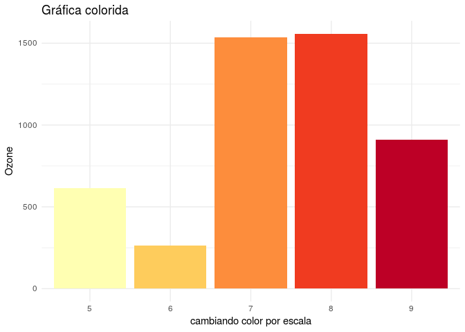
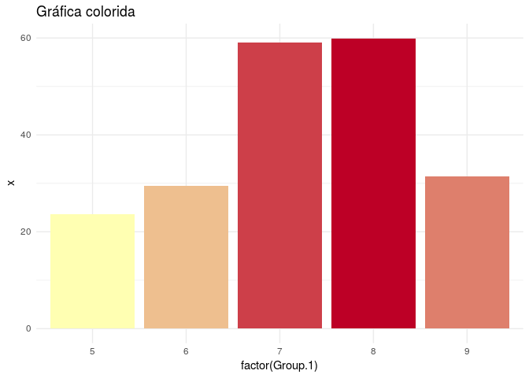

    library(ggplot2)
    # airquality # datos prueba
    ggplot(data = airquality, aes(x = factor(Month), y = Ozone, fill = factor(Month))) + #indicas la variable de agrupamiento -debe ser tipo factor- y la de interes, tambien requieres llenar el parametro 'fill' con la variable con la que agrupa 
        geom_bar(stat="identity") +   # se construyen las barras
        scale_fill_brewer(palette = 'RdPu')+ # la magia de poder escoger facíl el color de la escala 'continua' o discreta
        xlab('cambiando color por escala') + theme_minimal() +  ggtitle('Gráfica colorida')+  #demas cosas
        guides(fill=FALSE) #quitar leyenda

    ## Warning: Removed 37 rows containing missing values (position_stack).

    ggplot(data = airquality, aes(x = factor(Month), y = Ozone, fill = factor(Month))) + #indicas la variable de agrupamiento -debe ser tipo factor- y la de interes, tambien requieres llenar el parametro 'fill' con la variable con la que agrupa 
        geom_bar(stat="identity") +   # se construyen las barras
        scale_fill_brewer(palette = 'Set2')+ # la magia de poder escoger facíl el color de la escala 'continua' o discreta
        xlab('cambiando color por escala') + theme_minimal() +  ggtitle('Gráfica colorida')+    guides(fill=FALSE) #quitar leyenda

    ## Warning: Removed 37 rows containing missing values (position_stack).

    library(RColorBrewer)
    cols <- brewer.pal(length(levels(factor(airquality$Month))), "Reds") # numero de niveles en el factor
    names(cols) <- levels(factor(airquality$Month))
    ggplot(data = airquality, aes(x = factor(Month), y = Ozone, fill = factor(Month))) +    geom_bar(stat="identity") + 
        scale_fill_manual("legend", values = cols)  +
        xlab('cambiando color por escala') + theme_minimal() +  ggtitle('Gráfica colorida')+guides(fill=FALSE)

    ## Warning: Removed 37 rows containing missing values (position_stack).

    paleta <- colorRampPalette(c("#E7E1EF", "purple4")) # Escala continua personalizada
    cols <- paleta(length(levels(factor(airquality$Month))))
    names(cols) <- levels(airquality$Month)
    ggplot(data = airquality, aes(x = factor(Month), y = Ozone, fill = factor(Month))) +       geom_bar(stat="identity") + 
            scale_fill_manual("legend", values = cols)  + theme_minimal() +  ggtitle('Gráfica colorida')+guides(fill=FALSE)

    ## Warning: Removed 37 rows containing missing values (position_stack).

