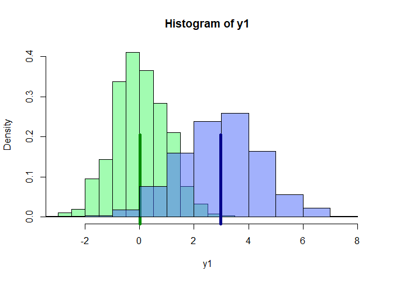
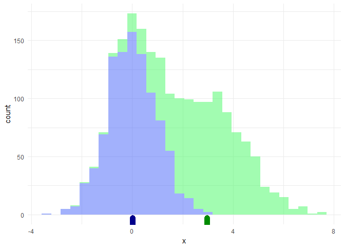

    y1 <- rnorm(1000,0,1)                                           #Tus datos
    y2 <- rnorm(1000, 3, 1.5)
    m.y1 <- mean(y1)
    m.y2 <- mean(y2)
    verde_trans <- rgb(70/255,  250/255,    100/255, .5)
    azul_trans <- rgb(70/255,   100/255,    250/255, .5)
    hist(y1, col = verde_trans, freq = FALSE, , xlim = c(-3,8))  #solo encimas la otra
    rug(m.y1, ticksize = 0.5, col = ' green4', lwd = 5)
    hist(y2, col = azul_trans, freq = FALSE, add = TRUE)             # Te sugiero imprimir primero la v.a. con mayor rango
    rug(m.y2, ticksize = 0.5, col = ' blue4', lwd = 5)

Usando ggplot es un poco más verboso pero se ve un poco mejor

    d <- data.frame(x = y1)               #Lo de siempre los datos
    d$origen <- 'N(0,1)'
    d1 <- data.frame(x = y2)
    d1$origen <- 'la otra v.a.'
    d <- rbind(d, d1)
    rayas <- data.frame(x_ = c(m.y1, m.y2))
    library(ggplot2)

    ggplot(d, aes( x = x)) + geom_histogram(aes(fill = origen)) +
      scale_fill_manual(name='',values=c(verde_trans, azul_trans) ) +
        geom_rug(data = rayas, aes(x = x_), color =  c('blue4', 'green4' )) +
      theme_minimal() +  theme(legend.position="none")

    ## `stat_bin()` using `bins = 30`. Pick better value with `binwidth`.

